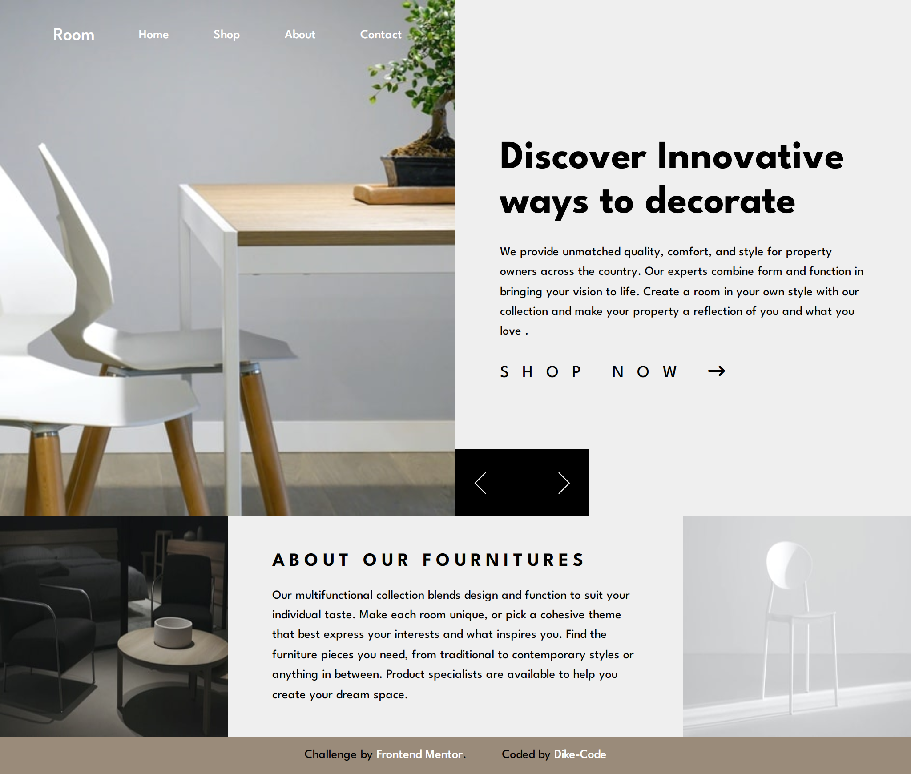
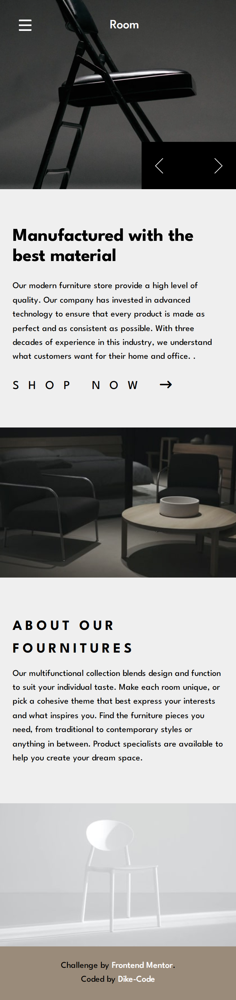

<!-- @format -->

# Frontend Mentor - Room homepage solution

This is a solution to the [Room homepage challenge on Frontend Mentor](https://www.frontendmentor.io/challenges/room-homepage-BtdBY_ENq). Frontend Mentor challenges help you improve your coding skills by building realistic projects.

## Table of contents

-  [Overview](#overview)
   -  [The challenge](#the-challenge)
   -  [Screenshot](#screenshot)
   -  [Links](#links)
-  [My process](#my-process)
   -  [Built with](#built-with)
   -  [What I learned](#what-i-learned)
   -  [Continued development](#continued-development)
   -  [Useful resources](#useful-resources)
-  [Author](#author)
-  [Acknowledgments](#acknowledgments)

## Overview

An e-commerce homepage Challange presented by Frontend Mentor... it's built with a pure HTML5 for laying out the structure, CSS for styling the website to make it more compelling, responsive and user friendly... Saas (CSS Pre-processor) which helps in executing a lot css styling with few lines of code. A little bit of Javascript was also utilized in order to make the site more interactive.

### The challenge

Users should be able to:

-  View the optimal layout for the site depending on their device's screen size
-  See hover states for all interactive elements on the page

### Screenshot

### Links

-  Solution URL: [Solution](https://github.com/Dike-Code/Testimonial-Grid-Section)
-  Live Site URL: [Live](https://dike-code.github.io/e-commerce-hompage/)

## My process

### Built with

-  Semantic HTML5 markup
-  CSS custom properties
-  Flexbox
-  CSS Grid
-  Saas
-  Desktop-first workflow
-  Javascript

### What I learned

I learnt all whole lot.

### Continued development

All, Practice... Practice and Practice.

### Useful resources

-  [Traversy Media](https://www.youtube.com/Traversy-Media) - This helped me with the full asimillation of CSS pre-processor Saas and Grid layouts and . I really liked this pattern Brad uses in explaining all the concepts one needs to master this craft.

-  [Youtube](https://www.youtube.com) - This is an amazing website/platform which helped me finally understand a lot including the snippets on buiding a dropdown list. I'd recommend it to anyone still learning this concept.

## Author

-  Frontend Mentor - [@Dike-Code](https://www.frontendmentor.io/profile/Dike-Code)

-  Github - [Dike.O.Clinton](https://github.com/Dike-Code)

## Acknowledgments

With utmost gratitude I'd like to acknowledge:
Freecodecamp
Traversy Media
Dev.Ed
Jon Dukket
Youtube.
